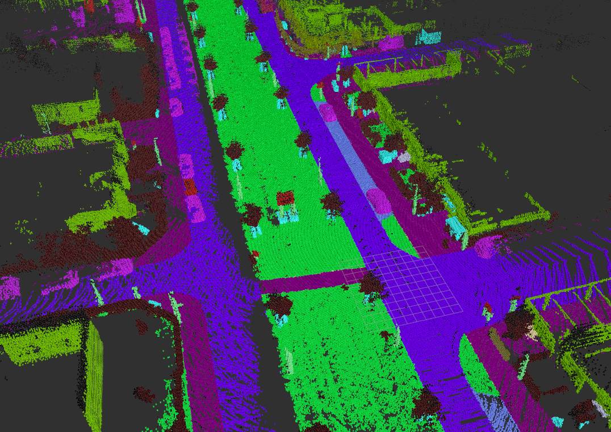

# Semantic Jaguar

This package contains ROS nodes that are able to generate a labelled pointcloud and create a semantic octomap representation.


## Semantic octomap
### Semantic KITTI - Sequence 06
  


### Acknowledgement

This work cannot be done without many open source projects. Special thanks to

- [semantic_slam](https://github.com/floatlazer/semantic_jaguar), used as a template for octomap generation.
- [octomap](https://github.com/OctoMap/octomap), used as our map representation.
- [pcl library](http://pointclouds.org/), used for point cloud processing.

# License

TODO

# Overview


# Dependencies
- octomap

# Installation

### Install dependencies

```sh
rosdep install semantic_jaguar
```

### Make

```sh
cd <your_catkin_work_space>
catkin_make
```

# Run

The node receiving pointcloud data is the `semantics_gen.py` script.

### Run with Kitti

First ensure you have the dataset structured as below:
```
dataset/
    └── sequences/
        └── 00/
            ├── velodyne/
            │   ├── 000000.bin
            │   └── 000001.bin
            ├── labels/
            │   ├── 000000.label
            │   └── 000001.label
            └── poses.txt
```

**TODO:**
- Add config for kitti 
- Add instructions
- Provide example folder

### Run semantic_mapping

You can run the semantic_cloud node and the octomap_generator node:

```sh
roslaunch semantic_jaguar semantic_mapping.launch
```

This will also launch rviz for visualization.

You can then move around the camera and construct semantic map. Make sure SLAM is not losing itself.

If you are constructing a semantic map, you can toggle the display color between semantic color and rgb color by running

```sh
rosservice call toggle_use_semantic_color
```
# Run with ros bag

TODO


# Configuration
__NOTE__: This is still in progress.


You can change parameters for launch. Parameters are in `./semantic_jaguar/params` folder.

***Note that you can set octomap/tree_type and semantic_cloud/point_type to 0 to generate a map with rgb color without doing semantic segmantation.***

### Parameters for octomap_generator node (octomap_generator.yaml)

namespace octomap

- pointcloud_topic
  - Topic of input point cloud topic
- tree_type
  - OcTree type. 0 for ColorOcTree, 1 for SemanticsOcTree using max fusion (keep the most confident), 2 for SemanticsOcTree using bayesian fusion (fuse top 3 most confident semantic colors). See project report for details of fusion methods.
- world_frame_id
  -  Frame id of world frame.
- resolution
  - Resolution of octomap, in meters.
- max_range
  - Maximum distance of a point from camera to be inserted into octomap, in meters.
- raycast_range
  - Maximum distance of a point from camera be perform raycasting to clear free space, in meters.
- clamping_thres_min
  - Octomap parameter, minimum octree node occupancy during update.   
- clamping_thres_max
  -  Octomap parameter, maximum octree node occupancy during update.
- occupancy_thres
  - Octomap parameter, octree node occupancy to be considered as occupied
- prob_hit
  - Octomap parameter, hitting probability of the sensor model.
- prob_miss
  - Octomap parameter, missing probability of the sensor model.
- save_path
  - Octomap saving path. (not tested)

### Parameters for semantic_cloud node (semantic_cloud.yaml)
***Note this is still in progress***

namespace semantic_pcl

- cloud_topic
  - Topic for output pointcloud.
- point_type
  - Point cloud type, should be same as octomap/tree_type. 0 for intensity point cloud, 2 for semantic point cloud including top 3 most confident semanic colors and their confidences, 1 for semantic including most confident semantic color and its confident.
- frame_id
  - Point cloud frame id.
- file_path
  - Path to the kitt semantic dataset folder.
